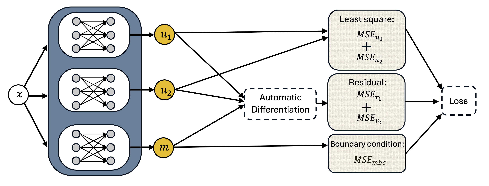

# Pytorch-PINN-Marine-Lake

This repository contains a **Physics-Informed Neural Network (PINN) implementation** for estimating the eddy diffusion coefficient in a **marine lake** environment. The project leverages PyTorch and auto-differentiation to solve inverse problems constrained by PDEs.

## 🔥 Features
- PINN-based solver for a **screened Poisson equation** modeling marine lake dynamics.
- Estimates a **spatially varying diffusion coefficient** from observational data.
- Implements multiple **boundary conditions** (Dirichlet/Neumann).
- Compares **PINN-based** inversion with a PDE-constrained optimization method.

## 🚀 Installation
To set up the environment and install dependencies, run:
```bash
git clone https://github.com/aho38/Pytorch-PINN-Marine-Lake.git
cd Pytorch-PINN-Marine-Lake
pip install -r requirements.txt

## Schematic of Model Recovery


